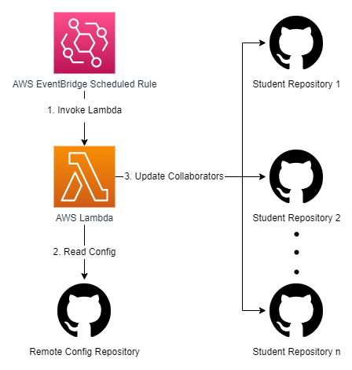

# GitHub Classrooms Deadline Enforcer

[GitHub Classrooms](https://classroom.github.com/) is an application from GitHub which allows educators to manage their students' programming projects. In my software engineering course at UNC Charlotte, I use GitHub Classrooms for weekly assignments, which allows students to fork a private repository (or start with a blank repository) which is automatically available to my instructional assistants and me. This allows students to easily start the assignments and my instructional team to easily access and grade assignments.

One missing feature from the application is the ability to revoke student write access after assignment deadlines. There is a deadline feature, however it does not actually revoke student write access, which is the behavior I want out of the feature. Looking at GitHub issues, it appears that active development on this application has ceased, so to enable this feature, I wrote the *GitHub Classrooms Deadline Enforcer*.

## ❗ What does it do?

This application runs as a scheduled job in the cloud to automatically revoke access to students' repositories after the due date has passed. Crucially, it also allows for specifying students who have extensions and when those extensions end.

To configure the assignment names, assignment deadlines, student usernames, and student extensions, I have set up a private GitHub repository which houses a single `config.json` file, which looks like the following:

```json
{
  "students": [
    {
      "name": "Tom Baker",
      "username": "number-four"
    },
    {
      "name": "David Tennant",
      "username": "number-ten"
    },
    {
      "name": "Peter Capaldi",
      "username": "number-twelve"
    }
  ],
  "assignments": [
    {
      "name": "test-assignment-1",
      "deadline": "2023-02-11"
    },
    {
      "name": "test-assignment-2",
      "deadline": "2023-02-12",
      "extensions": [
        {
          "name":"David Tennant",
          "deadline": "2023-02-13"
        }
      ]
    }
  ]
}
```

By simply modifying this file in the GitHub web editing interface, I treat this repository as a remote configuration service which the scheduled job reads in to know which repository permissions to update.

## ❓ How does it work?



This application utilizes the following technologies:

- Golang
- GitHub API
- AWS EventBridge
- AWS Lambda
- GitHub Actions

Every night, a scheduled rule in AWS EventBridge invokes an AWS Lambda function, written in go, which runs the code stored in this repository. That process then does the following:

1. Read the configuration from the remote config repository with the GitHub API
2. From the configuration, determine which student repositories need to be updated to have its student collaborator just have "read" permission
    1. If an assignment is due this day, update all students except those with an extension
    2. If there are students who had extensions for other assignments and they are due today, update their repositories as well
3. Update the repositories with the GitHub API so students only have read permissions
    1. Remove the students as collaborators for their repositories
    2. Add the students back with only the "read" permission

## 💻 How can I run it locally?

To run this repository, you need to have [Golang 19+](https://go.dev/) installed. Furthermore, if you want to run the tests as they would run inside CI, you will need [Docker](https://www.docker.com/) as well.

The dependencies are vendored, but you can also download them with the `go mod tidy` command. Run the code locally, bypassing the AWS lambda package, with `make run-local`.

### Run against the mock API

There is a mock API to mock the necessary GitHub endpoints in this repository. You can run this API with `make services` and the mock API will become available on `http://localhost:3000/github`. By default, running the application with `make run-local` will run against the mock service.

#### Tests

To run the tests, make sure the mock services are running and then run `make test`. To run the docker-compose stack that runs in GitHub Actions, run `make test-gha`.

### Run against GitHub

To actually run against GitHub, you can create a `.env` file to specify a base URL, GitHub personal access token, organization name, and remote config repository name.

```
GITHUB_BASE_URL=https://api.github.com
GITHUB_AUTH_TOKEN=AUTH_TOKEN_HERE
GITHUB_ORG_NAME=ORG_NAME_HERE
GITHUB_CONFIG_REPO_NAME=CONFIG_REPO_HERE
```

## 😢 Shortcomings

### Excessive configuration

There is a LOT of configuration in the `config.json` file that needs to be maintained throughout the semester. It would be great to pull the assignments and student names/usernames from GitHub Classrooms, however it seems that there is no public API by which I can get this information and no plans to create one. Ideally, it would be nice to pull information from GitHub Classrooms and even to pull due dates and extensions from my university's LMS, Canvas. Failing that, a UI to edit the config would be preferable to using a GitHub repository as a remote configuration service.

### Manual deployment

While CI is automated with GitHub Actions, deployments of this code to AWS Lambda are currently manual by running `make` and then uploading the zipped file to the AWS Console. Ideally, uploading this file would be done in GitHub Actions when a release is tagged.
